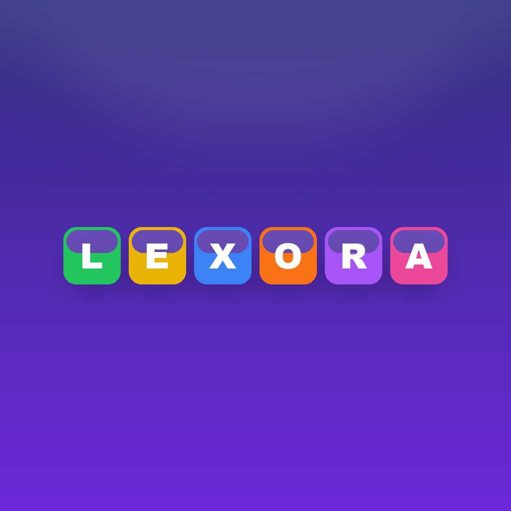

# Lexora

Guess the **WORD** in six tries.

<p align="center"><a href="https://grandelagbanou28-gif.github.io/Lexora/"></a></p>

Play it online: <https://grandelagbanou28-gif.github.io/Lexora/>

## Game modes

- **Daily** (default): one word per day
- **Level**: progressive levels

## Dictionaries

- English (EN)
- Fon (FON)
- French (FR)
- Russian (RU)

## Features

- Both daily and level game modes
- Four built-in dictionaries
- Statistics and attempt distribution
- Light / dark theme support
- Available on Android, iOS, Web, and desktop platforms
- Auto-deployed to GitHub Pages on every push to main

## Attribution

This project is based on [Wordly Plus](https://github.com/Carapacik/wordly-plus) by [Roman Laptev - Carapacik](https://github.com/Carapacik). All credit for the original design, code, and assets belongs to its author. Lexora is a continuation/rename of this project with the original attribution preserved.

## Getting started

```sh
flutter pub get
flutter run
```

## Tests

```sh
flutter test
```